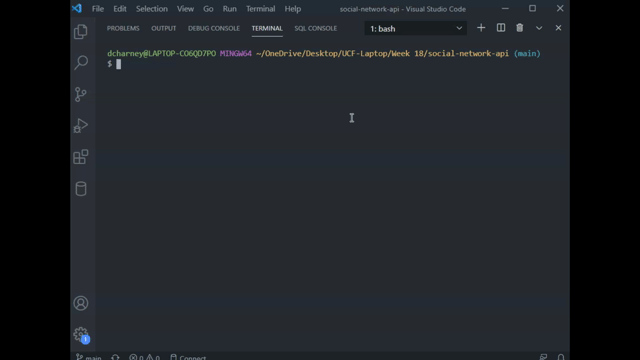

# social-network-api 
 
## Description

An API for a social network web application where users can share their thoughts, react to friends’ thoughts, and create a friend list.

## Table of Contents
- [Description](#description)
- [Technologies](#technologies)
- [Installation](#installation)
- [Usage](#usage)
- [License](#license)
- [Contributing](#contributing)
- [Author](#author)

## Technologies

This social network REST API was built using:

- javascript
- Mongodb
- Mongoose
- Express.js

## Installation

To use this app, simply clone the repository, install dependencies (npm install), and start the server (npm start).

**Happy Developing!**

## Usage

This reposoitory only consists of a fully developed **back-end** for a social networking application. A third party software, such as Insomnia Core as shown in the video walkthrough, is required to test the api routes. 

start serving using `npm start`

The following gifs demonstrate how the routes can be tested using Insomnia Core:

The following POST route can be used to create new users and the GET route will return all users in the database:

The image below shows how to GET the details on a single user by the userid along with the PUT route to revise their info and the DELETE route.

The userid and friendid can be used to add and remove friends via the following POST and DELETE routes:

In the image below, a new thought is created using a POST route that includes the userid tying the thought to a specific user. That thought is shown populated in the user details when you GET a user by their id. The route to GET all thoughts is also demonstrated.

The following routes can return a single thought, revise its text, and delete the thought from its id.

Reactions can be added and removed from thoughts, these are stored within the thought's model.

All data tied to a specific user will be displayed when you get a user from their id. Deleting a user will remove all their associated thoughts from the database.

A full walkthrough video can be viewed [here](https://drive.google.com/file/d/1Zw7dTrUV09jI7NnII_37cGO8XcGC8qQ7/view?usp=sharing).

## License

This project is in the public domain and free for any and all uses! More details on this (un)licensing statement can be found [here](https://unlicense.org/).

## Contributing

If you would like to contribute to this project, please follow the rules of the [Contributor Covenant](https://www.contributor-covenant.org/).

## Author

This application was written and developed by Delaney Charney for the week 18 challenge assingment of the UCF Coding Bootcamp. If you have any questions, open an issue or contact me directly at dcharney.dev@gmail.com. Check out the rest of my work on GitHub at [dcharney](https://github.com/dcharney).